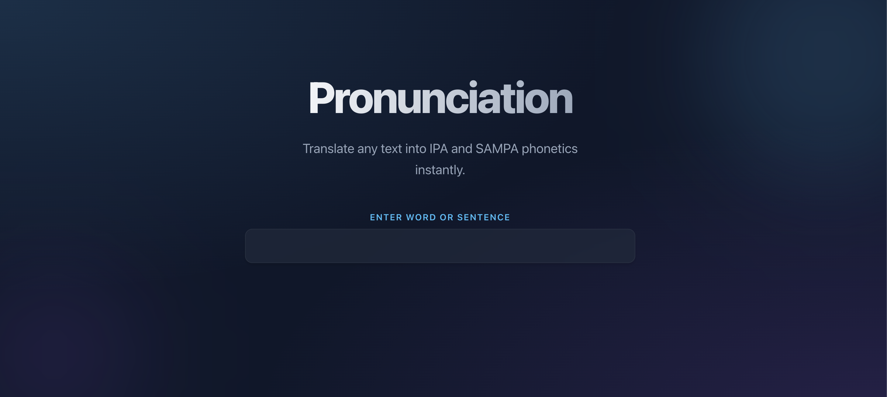

# 🗣️ Pronunciation

A lightning-fast, glassmorphic React tool that instantly converts words and sentences into IPA and SAMPA phonetics. Powered by the CMU Dictionary and the DataMuse API for intelligent "sounds-like" suggestions.



## ✨ Features

- **Instant Translation**: Real-time phonetic conversion to IPA and SAMPA as you type.
- **Smart Discovery**: Automatically suggests words that sound similar using the DataMuse API (for single words).
- **Sentence Support**: Handles both individual words and full sentences with proper spacing.
- **Modern UI**: A sleek, dark-themed interface featuring Glassmorphism, CSS gradients, and fluid animations.
- **No-Scroll Experience**: Optimized layout designed to fit perfectly on a single screen.

## 🛠️ Tech Stack

- **Framework**: [React](https://reactjs.org/) (with [Vite](https://vitejs.dev/))
- **Styling**: Vanilla CSS with Modern Glassmorphism techniques
- **Phonetics**: [CMU Pronouncing Dictionary](http://www.speech.cs.cmu.edu/cgi-bin/cmudict)
- **API**: [DataMuse API](https://www.datamuse.com/api/) for phonetic similarity

## 🚀 Getting Started

### Prerequisites

- Node.js (Latest LTS recommended)
- npm or yarn

### Installation

1. **Clone the repository**
   ```bash
   git clone https://github.com/your-username/pronunciation.git
   cd pronunciation
   ```

2. **Install dependencies**
   ```bash
   npm install
   ```

3. **Start the development server**
   ```bash
   npm run dev
   ```

4. **Open your browser**
   Navigate to `http://localhost:5173` to see the app in action.

## 📖 Usage

1. Type any English word or sentence into the main input field.
2. View the **IPA** (💡) and **SAMPA** (👂) transcriptions instantly.
3. For single words, explore the **"sounds like"** section to discover phonetically similar words.

## 📄 License

This project is open-source and available under the MIT License.
